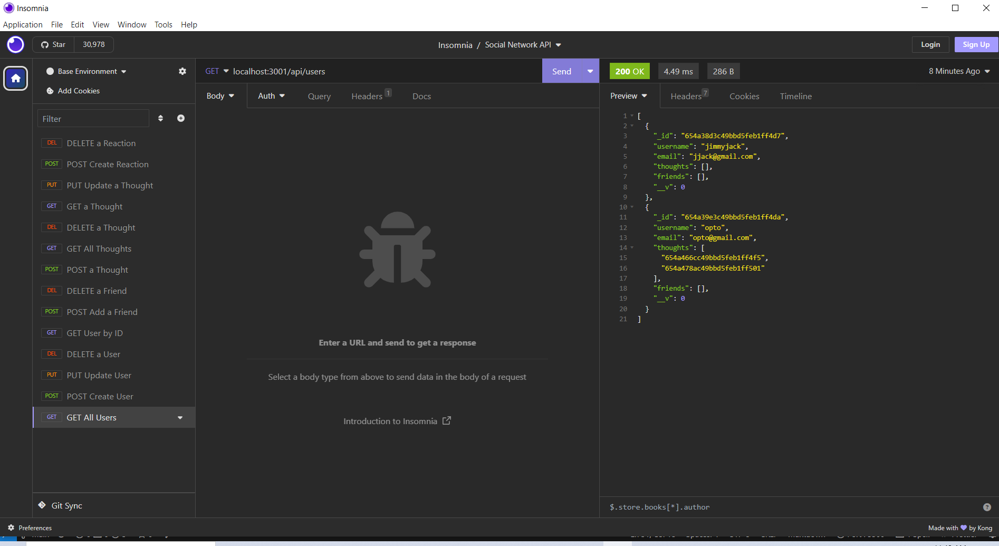

# Social Network API

## Description

This project will build an API for a social network web application where users can share their thoughts, react to friends’ thoughts, and create a friend list. It will use Express.js for routing, a MongoDB database, and the Mongoose ODM. It will also use a JavaScript date library moment to format timestamps.

## User Story

```md
AS A social media startup
I WANT an API for my social network that uses a NoSQL database
SO THAT my website can handle large amounts of unstructured data
```HAT my company can compete with other e-commerce companies
```

## Acceptance Criteria


```md
GIVEN a social network API
WHEN I enter the command to invoke the application
THEN my server is started and the Mongoose models are synced to the MongoDB database
WHEN I open API GET routes in Insomnia for users and thoughts
THEN the data for each of these routes is displayed in a formatted JSON
WHEN I test API POST, PUT, and DELETE routes in Insomnia
THEN I am able to successfully create, update, and delete users and thoughts in my database
WHEN I test API POST and DELETE routes in Insomnia
THEN I am able to successfully create and delete reactions to thoughts and add and remove friends to a user’s friend list
```base
```
## Usage

To view a demo of this application, please view to demo located at https://watch.screencastify.com/v/xe5d19bxNGVl3Jose33b

## Source

My repo, is located at <https://github.com/mcgreevyjim66/Social-Network-API>.
There is source code located in the Social-Network-API folder.

## Mock-up




## Credits

Author: Jim McGreevy
Date:   11/7/2-23

